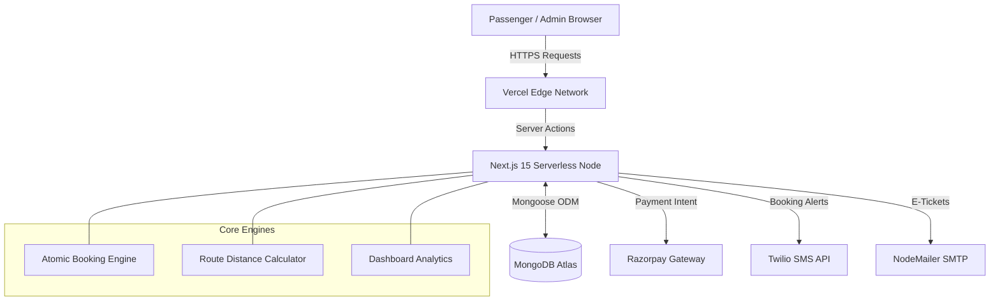
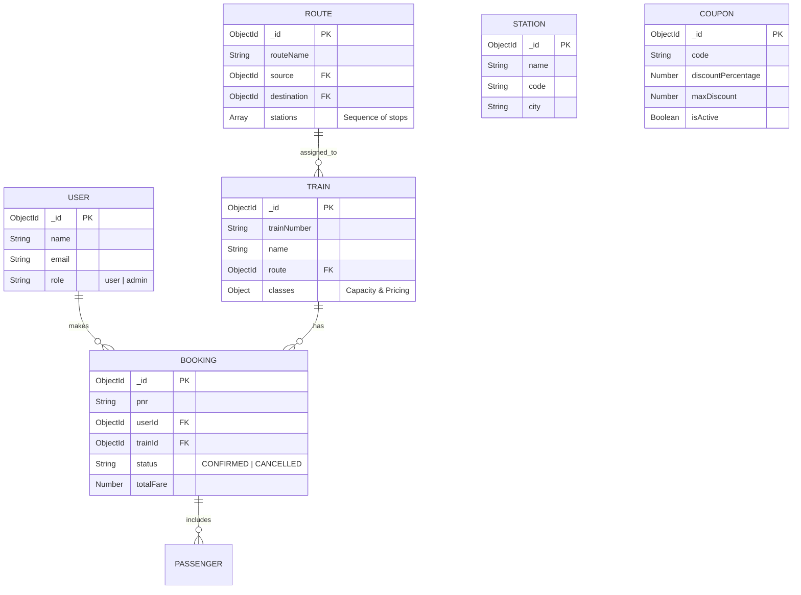

<div align="center">
  <h1>🚆 RailConnect</h1>
  <p><strong>Next-Generation Railway Ticketing & Fleet Management Ecosystem</strong></p>
  
  [](https://ticket-booking-ten-orpin.vercel.app)
  
  
  
  
  
  
  
</div>

<br/>

<div align="justify">
  <b>RailConnect</b> is a highly scalable, real-time railway ticketing and fleet management platform engineered for maximum concurrency and operational efficiency. Designed to handle thousands of simultaneous booking requests, it features a stunning glassmorphism-inspired UI, instant PNR generation, dynamic train route mapping, and an extensive Admin Super-Dashboard. Whether it's processing payments via Razorpay, sending SMS alerts via Twilio, or managing live train tracking, RailConnect delivers a frictionless, beautiful experience for both passengers and administrators.
</div>

## 🚀 Live Demo & Environments

🌍 **Launch Application:** [ticket-booking-ten-orpin.vercel.app](https://ticket-booking-ten-orpin.vercel.app)

To experience the full system architecture, use the following pre-configured demo accounts:

| Role | Email | Password | Access Portal |
| :--- | :--- | :--- | :--- |
| 🛡️ **System Admin** | `admin@irctc.co.in` | `admin123` | [Admin Login](https://ticket-booking-ten-orpin.vercel.app/admin/login) |
| 👤 **Passenger** | `hvdpvd4@gmail.com` | `123456` | [Public Portal](https://ticket-booking-ten-orpin.vercel.app) |

## ✨ Key Technical Achievements

🎟️ **Dynamic Route & Station Graph:** Supports complex multi-stop train routes with exact distance, halt duration, and day-offset tracking for precise schedule generation.

⚡ **Real-Time Booking Engine:** Prevents seat double-booking across different classes (1A, 2A, 3A, SL, CC) using atomic MongoDB transactions and calculates dynamic pricing based on distance.

🤖 **Automated Communication:** Fully integrated Twilio SMS and NodeMailer systems for instant PNR confirmations, trip reminders, and cancellation/refund alerts.

💳 **Automated Refund & Coupon System:** Built-in Razorpay checkout with custom promotional coupons and a streamlined admin-approval workflow for ticket cancellations and wallet refunds.

📊 **Super Admin Dashboard:** 11+ custom-built admin panels featuring high-performance pagination (Server & Client side) for managing Users, Trains, Routes, Revenue, Daily Bookings, and more.

## 1. System Architecture

<p align="justify">The platform operates on a modernized <b>Next.js 15 App Router</b> architecture, heavily utilizing React Server Components for SEO and fast initial loads, alongside interactive Client Components for complex states like search filters and seat selection.</p>



---

## 2. Database Schema Overview (ER Diagram)

<p align="justify">The database strictly enforces relational integrity within a NoSQL environment to track trains traversing across multiple stations.</p>



---

## 3. Advanced Features Deep Dive

### High-Performance Admin Pagination 📄
To handle massive datasets (e.g., thousands of daily bookings), RailConnect uses a hybrid pagination strategy:
- **Server-Side Pagination:** Used for `Revenue` and `Daily Bookings`. Next.js Server Components parse the `?page=` URL parameter, query MongoDB with `.skip()` and `.limit()`, and stream the exact chunk to the client. This allows for deep-linking (bookmarking page 5) and zero client-side RAM bloat.
- **Client-Side Pagination:** Used for `Stations`, `Trains`, and `Coupons`. Data is fetched once and cached in React state, providing instant 0ms page transitions via array slicing for optimal UX.

### Smart Distance Pricing & Routing 🗺️
Unlike static pricing, RailConnect calculates fares dynamically. When an admin creates a `Route`, they define the distance (in km) between stops. When a user searches for a train between two intermediary stations, the Booking Engine calculates the exact distance differential and multiplies it by the selected Seat Class multiplier.

---

## 4. Setup & Local Development Guide

<details>
<summary><strong>🛠️ Click to expand setup instructions</strong></summary>

### Prerequisites
- Node.js 18+
- MongoDB instance (Atlas or local)
- Razorpay Test Credentials

### Environment Variables (`.env`)
Create a `.env` file in the root directory:
```env
MONGODB_URI="mongodb+srv://<user>:<password>@cluster0..."
RAZORPAY_KEY_ID="rzp_test_***"
RAZORPAY_KEY_SECRET="***"

# Email Integration (nodemailer)
SMTP_HOST="smtp.gmail.com"
SMTP_PORT="587"
SMTP_USER="your_email@gmail.com"
SMTP_PASS="your_app_password"

# SMS Integration
TWILIO_ACCOUNT_SID="AC***"
TWILIO_AUTH_TOKEN="***"
TWILIO_PHONE_NUMBER="+1***"
```

### Installation

1. Clone the repository
```bash
git clone https://github.com/yash-shende99/Ticket-Booking.git
cd Ticket-Booking
```

2. Install dependencies
```bash
npm install
```

3. Run the development server
```bash
npm run dev
```

4. Open [http://localhost:3000](http://localhost:3000) with your browser.

</details>

---

## 📸 5. Application Gallery

<p align="justify">Explore the beautiful glassmorphism aesthetic and dense functionality of RailConnect.</p>

<div align="center">

### The Passenger Portal

| Search & Discover | Ticket Booking Flow |
| :---: | :---: |
|  |  |
| *Homepage featuring dynamic search and announcements* | *Adding passengers and verifying dynamic fare calculations* |

| My Bookings | Payment History |
| :---: | :---: |
|  |  |
| *Managing upcoming and completed trips with interactive tabs* | *Detailed ledger of all Razorpay transactions & refunds* |

### The System Admin Dashboard

| Admin Authentication | Revenue Analytics |
| :---: | :---: |
|  |  |
| *Secure login portal for system administrators* | *Server-side paginated breakdown of train performance* |

| Live Booking Management | Route Configuration |
| :---: | :---: |
|  |  |
| *Monitoring thousands of live tickets with instant search* | *Building complex multi-station routes with precise distance mapping* |

</div>

<br/>
<p align="center"><b>Engineered for Scale • Built with ❤️ by Yash Shende</b></p>
